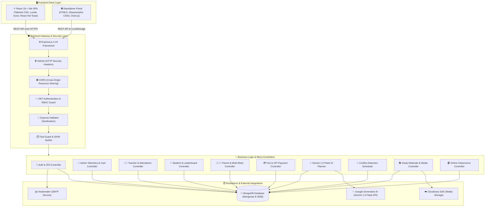

# 🎓 Kashvi SmartClass - Comprehensive Project Architecture & Technology Blueprint

---

## 📖 1. Project Overview & Objectives

**Kashvi SmartClass** is an enterprise-grade, full-stack **Academic Management & EdTech Platform** engineered for schools, coaching institutes, universities, and multi-branch educational organizations. 

The platform bridges communication and operational gaps among four core academic stakeholders:
1. **Administrators (Institution Management)**: Centralized telemetry, staff/student directory management, clash-free academic scheduling, and financial collection tracking.
2. **Teachers (Faculty)**: Quick attendance tracking, homework assignment & submission evaluations, live classroom streaming, and study material dissemination.
3. **Students (Learners)**: Real-time attendance health, interactive homework submissions, peer leaderboard analytics, daily knowledge boosters, and **AI-powered personalized study plans**.
4. **Parents (Guardians)**: Multi-ward switching, daily presence monitoring, term report cards, and **instant digital tuition fee settlements via dynamic UPI QR codes**.

---

## 🏗️ 2. System Architecture Diagram



---

## 🛠️ 3. Complete Tools, Purpose & Techniques Used

| Component / Layer | Tool / Library | Version | Specific Purpose in Project | Technical Technique / Pattern Applied |
| :--- | :--- | :--- | :--- | :--- |
| **Frontend Framework** | **React.js** | `^18.3.1` | Building componentized, reactive single-page application (SPA). | Component Lifecycle, Hooks (`useState`, `useEffect`, `useContext`, `useLocation`), Virtual DOM Reconciliation. |
| **Build & Dev Tool** | **Vite** | `^5.3.1` | Next-generation bundling and ultra-fast Hot Module Replacement (HMR). | Native ES Module (ESM) serving, Rollup-based production bundling, CSS code splitting. |
| **Styling & Design** | **Tailwind CSS** | `^3.4.4` | Modern UI styling, dark-mode themes, and glassmorphic dashboards. | Utility-first CSS, JIT (Just-In-Time) compilation, CSS Backdrop Filters (`backdrop-blur-xl`). |
| **Client Routing** | **React Router DOM** | `^6.26.1` | Client-side routing, nested dashboard tabs, and role-based route guards. | Declarative Routing, Protected Route Wrappers (`ProtectedRoute.jsx`), Future Flags (`v7_relativeSplatPath`). |
| **Icons & Visuals** | **Lucide React** | `^0.395.0` | Crisp, scalable SVG icons across sidebars, action buttons, and status chips. | Tree-shakable SVG icon components with customizable stroke and size properties. |
| **User Notifications** | **React Hot Toast** | `^2.4.1` | Lightweight, animated toast alerts for operation feedback. | Promise-based toast dispatching, auto-dismiss timers, custom icon styling. |
| **HTTP Client** | **Axios** | `^1.7.2` | REST API communication between React and Express backend. | Request Interceptors (JWT token injection), Response Interceptors (auto 401 session expiry redirect). |
| **Backend Runtime** | **Node.js** | `v18+` / `v20+` | Asynchronous JavaScript runtime powering the REST API. | Event Loop, Non-blocking I/O, ES Module syntax (`import`/`export`). |
| **Web API Framework** | **Express.js** | `^4.19.2` | Structuring RESTful API routes, controllers, and middleware pipeline. | MVC (Model-View-Controller) Pattern, Middleware Pipeline, Centralized Error Handling. |
| **Database** | **MongoDB** | `v6.0+` | NoSQL document-oriented database storing institutional entities. | BSON Document Storage, Dynamic Collections, Compound Indexes, Aggregation Pipelines. |
| **ODM Layer** | **Mongoose** | `^8.4.1` | Object Data Modeling and schema enforcement for MongoDB. | Strict Schemas, Schema Validation, Async Pre-save Hooks, References & Population (`ref: 'User'`). |
| **Authentication** | **JSON Web Token (`jsonwebtoken`)** | `^9.0.2` | Stateless authentication and verified identity claims. | HMAC-SHA256 Token Signing, Bearer Header Token Transport, Expiry Validation (`7d`). |
| **Password Security** | **Bcrypt.js** | `^2.4.3` | One-way cryptographic hashing of user passwords. | Adaptive Salt Generation (Cost Factor 10), Key Derivation Function, Constant-Time Comparison. |
| **AI Intelligence** | **Google Gemini 1.5 Flash API** | `v1beta` | Generating personalized 7-day academic study timetables. | Prompt Engineering, Contextual Student Telemetry (Scores, Weak Subjects), JSON Schema Enforcement. |
| **Security Headers** | **Helmet** | `^7.1.0` | Securing Express apps by setting appropriate HTTP response headers. | Cross-Site Scripting (XSS) Filter, Content-Security-Policy (CSP), Clickjacking Frameguard. |
| **CORS Control** | **CORS** | `^2.8.5` | Managing allowed cross-origin HTTP requests between Vite frontend and Express. | Whitelisting allowed origins, headers (`Authorization`, `Content-Type`), and credentials. |
| **Input Sanitization** | **Express-Validator** | `^7.1.0` | Validating and sanitizing API request bodies and query parameters. | Schema Validation, Type Checking, String Sanitization to prevent NoSQL injection. |
| **File Uploads** | **Multer** | `^1.4.5` | Processing `multipart/form-data` uploads for homework and study notes. | Stream-based file parsing, disk storage allocation, MIME-type filtering. |
| **Cloud Storage** | **Cloudinary SDK** | `^2.2.0` | Cloud hosting and CDN delivery for uploaded documents and images. | API Upload Protocol, Secure HTTPS CDN Links, Automated Format Optimization. |
| **Email Service** | **Nodemailer** | `^6.9.13` | Sending password reset OTP codes and academic notifications. | SMTP Protocol Transport, HTML Email Templates, Asynchronous Dispatch. |
| **Payments** | **Dynamic UPI QR Engine** | Custom | Instant zero-fee UPI payment generation for parents. | Standard `upi://pay` URI Scheme, URL Encoding, Real-time Transaction ID generation. |

---

## 🔒 4. Specialized Business Logic & Technical Algorithms

### 1. Timetable Conflict Detection Engine (`timetableController.js`)
Prevents room, teacher, or class schedule collisions by checking temporal overlaps:
$$\text{Overlap} = (\text{Start}_A < \text{End}_B) \land (\text{End}_A > \text{Start}_B)$$
- **`TEACHER_COLLISION`**: Blocks assigning a teacher to two separate classes in the same time slot.
- **`CLASS_COLLISION`**: Blocks scheduling two different subjects for the same batch simultaneously.
- **`ROOM_COLLISION`**: Blocks double-booking physical or virtual classrooms.

### 2. Strict Parent-Child IDOR Prevention (`parentAuth.js`)
Protects sensitive student grades and financial records from Insecure Direct Object References (IDOR):
- Verifies that any requested `studentId` belongs explicitly to the authenticated parent's `children` array or matches `student.parentEmail === parent.email`.
- Rejects unlinked requests with `403 Forbidden` with **zero random fallback leaks**.

### 3. Dynamic Leaderboard Scoring Algorithm (`studentController.js`)
Calculates real-time student batch rankings using a multi-factor weighted scoring formula:
$$\text{Composite Score} = (0.70 \times \text{Average Test Marks}) + (0.30 \times \text{Attendance Percentage})$$
- Automatically segments students into **Batch Topper (#1)**, **Honor Roll (Top 3)**, and **Scholar Tiers**.

### 4. Dynamic UPI Payment & Verification Flow (`feeController.js`)
- Generates standard UPI payment strings:
  ```
  upi://pay?pa=kashvi.edu@icici&pn=Kashvi%20SmartClass&am=3500&cu=INR&tn=Fee%20Invoice%20September%20Aarav%20Sharma
  ```
- Renders dynamic high-contrast vector QR codes.
- Verifies transaction upon submission and generates a formal institutional receipt (`REC-2024-XXXXXX`).

### 5. Gemini 1.5 Flash AI Study Planner (`aiController.js`)
- Contextualizes prompt with the student's recent test scores, attendance health, target exam, and daily availability.
- Requests strict JSON response structure with day-by-day topics, difficulty priorities, and cognitive focus advice.
- Features a **built-in adaptive fallback engine** to ensure guaranteed generation even when offline or without external API keys.
- Persists all generated plans in MongoDB (`StudyPlan` collection) for instant reload on revisit.

---

## 🗄️ 5. Database Schema & Data Models

| Model | File Path | Key Attributes & Relations |
| :--- | :--- | :--- |
| **`User`** | [`backend/models/User.js`](file:///d:/kashvi/backend/models/User.js) | `uniqueId`, `name`, `email`, `password` (hashed), `role` (`admin`/`teacher`/`student`/`parent`), `class`, `subject`, `children`, `twoFactorSecret`, `subscriptionStatus`. |
| **`Attendance`** | [`backend/models/Attendance.js`](file:///d:/kashvi/backend/models/Attendance.js) | `studentId`, `studentName`, `class`, `date`, `status` (`present`/`absent`/`late`/`excused`), `markedBy`, `subject`. |
| **`Homework`** | [`backend/models/Homework.js`](file:///d:/kashvi/backend/models/Homework.js) | `title`, `description`, `subject`, `class`, `teacherId`, `dueDate`, `attachments`, `submissions` (`studentId`, `fileUrl`, `submittedAt`, `feedback`). |
| **`StudyPlan`** | [`backend/models/StudyPlan.js`](file:///d:/kashvi/backend/models/StudyPlan.js) | `studentId`, `targetGoal`, `targetExam`, `studyHoursDaily`, `weakSubjects`, `weeklySchedule`, `recommendations`, `provider`. |
| **`Fee`** | [`backend/models/Fee.js`](file:///d:/kashvi/backend/models/Fee.js) | `studentId`, `studentName`, `class`, `month`, `year`, `amount`, `dueDate`, `paidDate`, `status` (`pending`/`paid`/`overdue`), `receiptNumber`, `transactionId`. |
| **`Timetable`** | [`backend/models/Timetable.js`](file:///d:/kashvi/backend/models/Timetable.js) | `class`, `subject`, `teacher` (`User` ref), `teacherName`, `day`, `startTime`, `endTime`, `room`. |
| **`StudyMaterial`** | [`backend/models/StudyMaterial.js`](file:///d:/kashvi/backend/models/StudyMaterial.js) | `title`, `description`, `subject`, `class`, `uploadedBy`, `uploaderName`, `fileUrl`, `fileName`, `fileSize`, `fileType`. |
| **`OnlineClass`** | [`backend/models/OnlineClass.js`](file:///d:/kashvi/backend/models/OnlineClass.js) | `title`, `subject`, `class`, `teacherId`, `scheduledAt`, `duration`, `meetingUrl`, `platform`, `description`. |
| **`Report`** | [`backend/models/Report.js`](file:///d:/kashvi/backend/models/Report.js) | `studentId`, `studentName`, `class`, `term`, `academicYear`, `subjects` (`name`, `marks`, `maxMarks`, `grade`, `remarks`), `percentage`, `overallGrade`. |
| **`Test`** | [`backend/models/Test.js`](file:///d:/kashvi/backend/models/Test.js) | `title`, `subject`, `class`, `teacherId`, `totalMarks`, `questions`, `attempts` (`studentId`, `score`, `percentage`). |
| **`Announcement`** | [`backend/models/Announcement.js`](file:///d:/kashvi/backend/models/Announcement.js) | `title`, `content`, `category`, `targetRole`, `priority`, `authorName`, `isPublished`. |

---

## ⚡ 6. Quick Execution Reference

```bash
# 1. Install all dependencies
npm run install:all

# 2. Seed initial MongoDB demo data
npm run seed

# 3. Start Backend API Server (Port 5000)
npm run dev:backend

# 4. Start React Frontend (Port 5173)
npm run dev:frontend
```

---

## 🔑 Default Demo Login Matrix

| Role | Email | Password | Access Scope |
| :--- | :--- | :--- | :--- |
| **Admin** | `admin@kashvi.com` | `Admin@2024` | Complete institutional governance, timetables & users |
| **Teacher** | `teacher@kashvi.com` | `Teacher@123` | Class 10-A attendance, homework hub & live classes |
| **Student** | `student@kashvi.com` | `Student@123` | Class 10-A student portal, homework submission & AI planner |
| **Parent** | `parent@kashvi.com` | `Parent@123` | Multi-ward attendance, fee QR payments & report cards |
